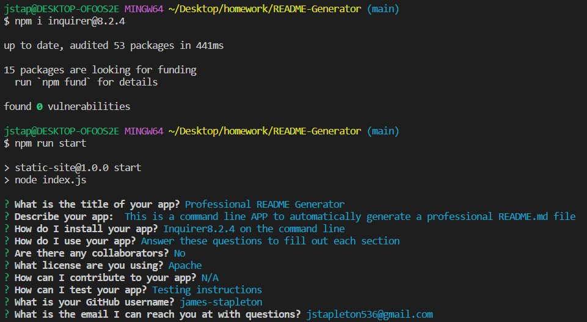

# Professional README Generator  
  ;

## Description 

This is a command line app that automatically generates a professional README.md file
            
## Table of Contents 
            
- [Installation](#installation)
- [Usage](#usage)
- [Credits](#credits)
- [License](#license)
- [Contribute](#contribute)
- [Testing](#tests)
- [Github](#github)
- [Questions](#questions)
            
## Installation
            
Copy the files and run on the command line
            
## Usage
            
Answer these questions to fill out each section
            
## Credits

No
                
## License 
  This project is being licensed under Apache. You can read the license here: https://opensource.org/licenses/Apache-2.0
                        
## Contribute

Contribute instructions
            
## Tests
            
Test instructions

## GitHub

[Github](https://github.com/james-stapleton)
            
## Questions
            
If you have any questions, please email me at jstapleton536@gmail.com with the subject "Professional README Generator"

## Screenshots

 

